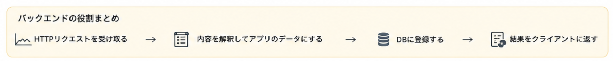

# 第 0 回：作るアプリケーションの概略

## Web アプリとは？

検索エンジンによると以下らしいです。

```txt
Webアプリケーションとは、パソコンやスマートフォンにソフトウェアをインストールすることなく、Webブラウザ上で直接利用できるシステムやサービスのことです。クラウド上のサーバーでデータや処理が管理されているため、インターネット環境があればどこからでも同じように利用できます。
```

## 今回作るアプリケーション

このリポジトリでは、RESTっぽいバックエンドアプリケーションの作成を目標とします。

学習目標は以下の通りです。

- バックエンドの技術に触れる
- JSの基本文法の応用例に触れる
- RESTっぽいエンドポイントを作る
- CRUDに触れる
- 堅牢なディレクトリ構成に触れる

## バックエンドアプリケーションとは？

バックエンドアプリケーションとは、Webの通信のルールであるHTTPリクエストを解釈し、適切なHTTPレスポンスを返すことにあります。

図にするとわかりやすいかもです。



## CRUD とは？

CRUD とはデータを管理するための4機能を纏めて呼んだ呼び方です([参考](https://developer.mozilla.org/ja/docs/Glossary/CRUD))。

- **C** reate
  - データの作成
- **R** ead
  - データの読込
- **U** pdate
  - データの更新
- **D** elete
  - データの削除 

バックエンドアプリケーションの基礎は、このCRUD操作をHTTPリクエストで制御するということです。
このリポジトリではそれをやりましょうということです。

余談ですが、HTTPリクエストには「安全」と「冪等(べきとう)」と言われる概念があります。
この概念とCRUDを結び付けておくと、良いエンジニアになれる気がします。

## 各回の予定

1. サーバーサイドフレームワークの環境構築
2. データベースの環境構築
3. CRUD 操作の定義
4. CRUD 操作の提供
5. フロントエンド作成 (おまけ)
